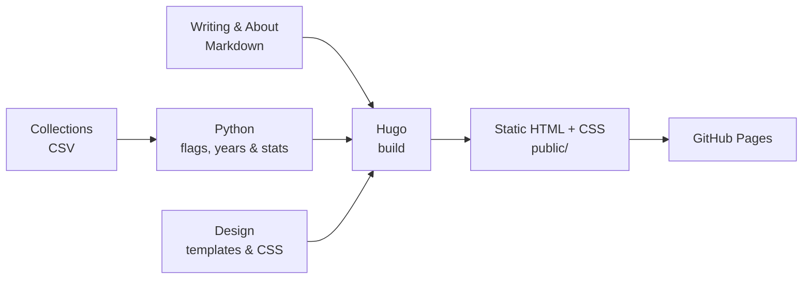

# FrankKair.github.io

Frank’s personal website: writing and collections of books, films, music, travel and live performances.

## How it works



**Hugo is the build engine; there is no theme.** Our templates in `layouts/` and stylesheet in `assets/css/site.css` define the design. Python prepares the CSV collections before Hugo builds. Visitors receive static files—neither Hugo nor Python runs on the server.

## Run locally

Use **Hugo 0.167.0** and **Python 3.11+**. Hugo Extended works too. No pip or npm packages are needed.

```sh
make serve     # preview, including drafts: http://localhost:1313
make generate  # regenerate collections after editing a CSV
make build     # production output in public/; removes stale output
make check     # tests, build, and rendered data/link/RSS checks
```

CI pins Hugo 0.167.0 and Python 3.12. To use other executable paths, pass `HUGO=/path/to/hugo` or `PYTHON=python3.12` to Make.

## Add content

**Collections:** edit the relevant file in `csv/`, keeping its headers and quoting fields containing commas. Dates use `dd/mm/yyyy`; partial dates and blanks are supported. Entries keep their CSV order within each year. Run `make check`, then commit the CSV.

Type plain country names (`UK`, `USA`, `Japan`), separating multiple countries with ` / `. `countries.py` supplies flags at build time; add missing names there. Historical labels such as `Rome` stay unflagged.

`publications.toml` controls categories, labels, year grouping and statistics. Add a category with a unique `slug`, `title` and `csv` path; set `published = false` to hide it. Generated Markdown and JSON are ignored by Git. The generator never rewrites CSVs or authored articles.

**Writing:** create an article with:

```sh
hugo new content writing/my-first-note.md
```

Edit its title, date, description, optional tags and Markdown body. Set `draft = false` and use a date that isn’t in the future to publish. Articles appear at `/writing/`, on the homepage and in [the writing RSS feed](https://frankkair.github.io/writing/index.xml).

Edit `content/_index.md` for the introduction and `content/about.md` for About. Loose files in the repository root aren’t published.

## Deploy

Push or merge to `main`, or run [the workflow](.github/workflows/hugo.yaml) manually. GitHub Actions tests the generator, generates collections, builds and verifies the site, then deploys `public/` to GitHub Pages. The repository’s Pages source must be **GitHub Actions**.

Old collection links redirect to `/collections/`. See [the revamp notes](docs/website-revamp.md) for the route inventory and verification results.
